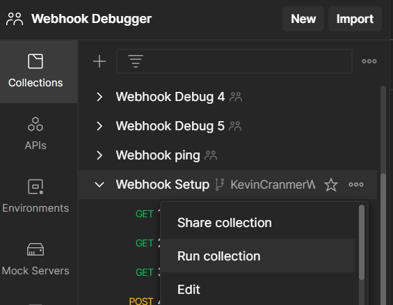
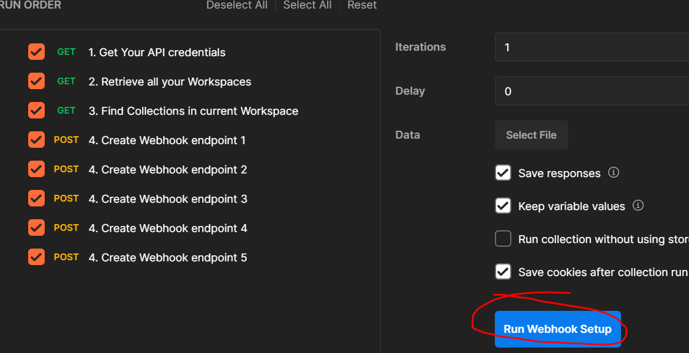
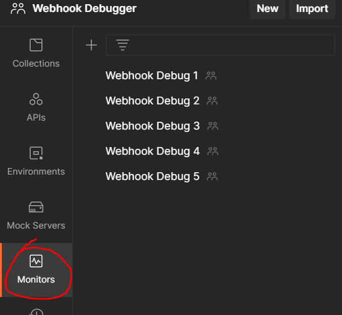

# Webhook Testing Guide

Utilizing Postman, we can create and send webhook URLs to our API using webhooks
and verify that our webhook implementation is sending the correct responses back to the provided URLs.

### 1. Create a new Postman workspace named "Webhook Debugger"
Create a new Postman workspace. The new workspace HAS to be named 
"Webhook Debugger" in order for the setup to work automatically.

### 2. Import relevant collections/environments
Import all collections and environments in this directory into your new workspace.

### 3. Generate your postman API key
Create your own Postman API key in your [settings page](https://postman.co/settings/me/api-keys). 
Then, paste your API key in the POSTMAN_API_KEY variable in your environment:

### 4. Run the Webhook Setup collection
Running this collection will create 5 webhook URL endpoints that we 
will use to send to our API.

### 5. Verify the Monitors were created
Close and re-open Postman to refresh. Then check Monitors; there should be 5. 
These are essentially http servers that will be receiving the webhook responses.

### 6. Send a request to your API
First, we have to set some variables. Set the number of webhook urls you 
want to test (1-5) in the environment variables num_webhook_urls. Set your
 vets-api apikey in the apikey variable.

Then run your API test collection. Same as we did for the Webhook 
Setup collection. You can view the Monitors to see the different test cases.

The Benefits Intake collection can serve as a great example. The first POST 
request in that collection is doing the subscription -- see the body 'webhook' 
parameter. For other APIs, the subscription request should be utilized and 
then configure other requests as needed for your API.

### 7. Viewing the webhook responses
To view the notifications that our Postman Monitors have received, go back to 
the Monitors page and select a monitor. Each notification will show as a bar 
in the monitors chart:

Select a notification you want to inspect and scroll down to select the 
"Console Log" tab. Scroll down more to view the contents of the notification. 
The "data" object in the Console Log is the message received.

Benefits Intake notification data example:

### Testing the webhook setup
Running the Webhook ping collection will send a dummy response to num_webhook_urls 
of the monitors to verify if the setup was completed successfully.

